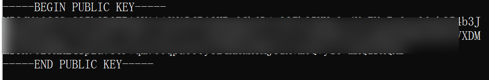
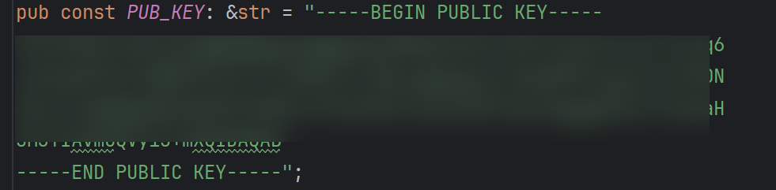

# Rust-Beacon

使用 rust 实现的 CobaltStrike 的 beacon。

*本项目仅供学习协议分析和逆向工程使用，如有侵犯他人权益，请联系我删除该项目，请勿非法使用*

*本项目未作任何免杀处理，这也不是本项目开源的目的，因此请不要提相关issue*

## Features

目前实现了命令执行，文件管理，进程管理，进程注入/迁移（支持自注入选项），令牌伪造/提权，cs原生hashdump，bof内存加载等功能，部分功能可能存在bug。

## Usage

##### Step 1

首先找到你的`.cobaltstrike.beacon_keys`文件，和项目中的`dump_key.py` 放到同一目录下，运行命令

`python dump_key.py`

将得到的 public key 放到 `src/config/mod.rs` 处即可

##### Step 2

在`src/config/mod.rs`处填写自定义内容，如server端 ip，端口等

##### Step 3

编译项目

`cargo build --release`

测试时工具链使用的是`nightly-x86_64-pc-windows-gnu`

## ToDo

- 内存加载 powershell/C# 
- job功能的完善
- DNS类型Beacon适配
- 更丰富的profile内容适配

## reference

感谢以下项目和文章的帮助：

[b1tg/cobaltstrike-beacon-rust](https://github.com/b1tg/cobaltstrike-beacon-rust)

[Z3ratu1/geacon_plus](https://github.com/Z3ratu1/geacon_plus)

[CobaltStrike beacon二开指南 | Z3ratu1's blog](https://blog.z3ratu1.top/CobaltStrike beacon二开指南.html)

[mai1zhi2/SharpBeacon](https://github.com/mai1zhi2/SharpBeacon)

[魔改CobaltStrike：重写Stager和Beacon-编程技术](https://bbs.kanxue.com/thread-269115.htm#msg_header_h2_0)

[hakaioffsec/coffee](https://github.com/hakaioffsec/coffee)

[Cobalt Strike BOF原理分析](https://tttang.com/archive/1786/)

[WBGlIl/ReBeacon_Src](https://github.com/WBGlIl/ReBeacon_Src)

## 免责声明

- 本项目仅用于网络安全技术的学习研究，若使用者在使用本项目的过程中存在任何违法行为或造成任何不良影响，需使用者自行承担责任，与项目作者无关。
- 本项目完全开源，请勿将本项目用于任何商业用途。
- 本人不参加各类攻防演练以及境内外渗透项目，如溯源到本人id或者项目，纯属巧合。
